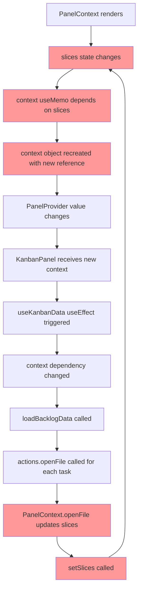
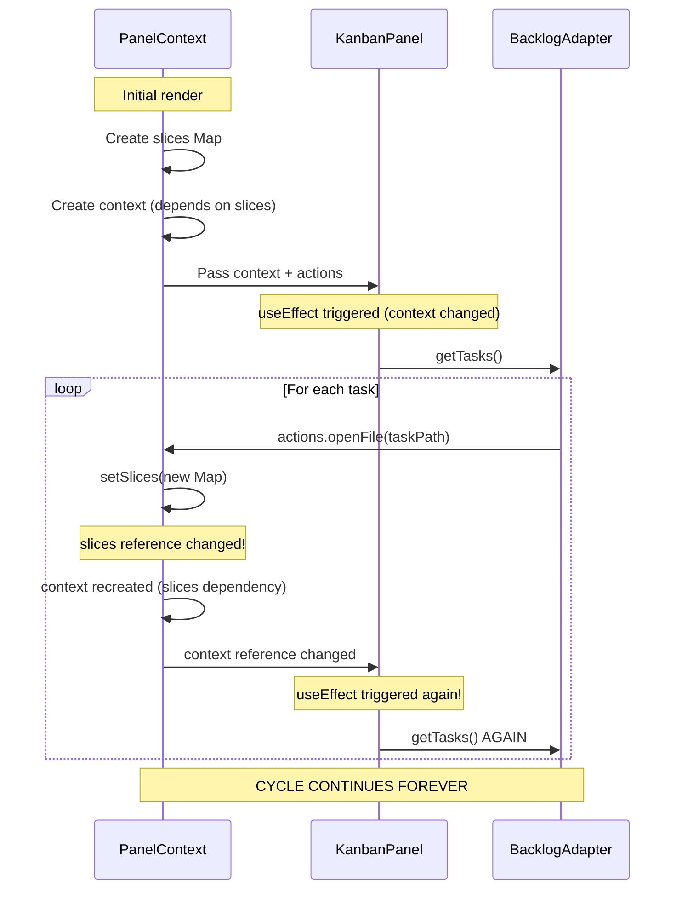

# React Re-render Cycle Analysis

## The Problem: Infinite Re-render Loop

You've identified a cycle that's causing the kanban panel to re-fetch data repeatedly. Let me trace where this cycle occurs.

## The Cycle Location: **YOUR INTEGRATION** (Not the Panel)

The cycle is in **your PanelContext implementation**, specifically in how `context` and `actions` objects are being recreated.

## The Complete Cycle Diagram



## Code-Level Breakdown

### Step 1: PanelContext Creates Context Object

**File:** `web-ade/src/contexts/PanelContext.tsx:481-517`

```typescript
const context: PanelContextValue = useMemo(
  () => ({
    currentScope: { /* ... */ },
    slices,  // ← DEPENDS ON SLICES STATE
    getSlice: <T,>(name: string) => slices.get(name),
    // ... other methods that reference slices
  }),
  [slices, workspace, repository, refresh, githubRepo]  // ← slices is a dependency
);
```

**Problem:** Every time `slices` state changes, `context` gets a new object reference.

### Step 2: Actions Object Depends on Events

**File:** `web-ade/src/contexts/PanelContext.tsx:520-621`

```typescript
const actions: PanelActions = useMemo(
  () => ({
    openFile: async (filePath: string) => {
      // ...
      // Update active-file slice
      setSlices((prev) => {  // ← UPDATES SLICES STATE
        const newMap = new Map(prev);
        const activeFileSlice = newMap.get('active-file');
        if (activeFileSlice) {
          activeFileSlice.data = activeFileData;
          // ...
        }
        return newMap;  // ← NEW MAP REFERENCE
      });
      // ...
    },
    // ...
  }),
  [events, githubRepo]
);
```

**Problem:** `openFile` calls `setSlices`, which triggers Step 1 again.

### Step 3: Multiple useEffects Update Slices

**File:** `web-ade/src/contexts/PanelContext.tsx:384-417`

```typescript
// Update active-file slice when README is fetched
useEffect(() => {
  if (markdownContent && githubRepo) {
    // ...
    setSlices((prev) => {  // ← UPDATES SLICES
      const newMap = new Map(prev);
      const activeFileSlice = newMap.get('active-file');
      if (activeFileSlice) {
        activeFileSlice.data = activeFileData;
        // ...
      }
      return newMap;  // ← NEW REFERENCE
    });
  }
}, [markdownContent, markdownLoading, markdownError, githubRepo]);
```

**Problem:** Every time a file is fetched, slices is updated with a new Map reference.

### Step 4: Kanban Panel's useEffect

**File:** `industry-themed-backlogmd-kanban-panel/src/panels/kanban/hooks/useKanbanData.ts:178-183`

```typescript
const loadBacklogData = useCallback(async () => {
  // ...
  const tasks = await adapter.getTasks(false);
  // ...
}, [context, actions, fetchFileContent]);  // ← DEPENDS ON CONTEXT AND ACTIONS

// Load data on mount or when context changes
useEffect(() => {
  loadBacklogData();
}, [loadBacklogData]);  // ← RE-RUNS WHEN loadBacklogData CHANGES
```

**Problem:** When `context` reference changes, `loadBacklogData` is recreated, triggering the useEffect.

## Why This Creates an Infinite Loop



## The Root Causes

### 1. Slices is Immutably Updated (Correct Pattern, But...)

Every `setSlices` call creates a new Map:
```typescript
setSlices((prev) => {
  const newMap = new Map(prev);  // ← New object every time
  // mutate newMap
  return newMap;
});
```

This is correct for React, but triggers downstream re-renders.

### 2. Context Depends on Slices Reference

```typescript
const context = useMemo(
  () => ({ slices, /* ... */ }),
  [slices]  // ← Changes every time slices is updated
);
```

Since `slices` is a Map (reference type), even if the data inside is the same, the reference changes.

### 3. Panel's loadBacklogData Depends on Context

```typescript
const loadBacklogData = useCallback(
  async () => { /* ... */ },
  [context, actions, fetchFileContent]  // ← Recreated when context changes
);

useEffect(() => {
  loadBacklogData();
}, [loadBacklogData]);  // ← Runs when loadBacklogData changes
```

### 4. Loading Tasks Mutates Slices

When `loadBacklogData` calls `actions.openFile`, it triggers `setSlices`, completing the cycle.

## Where is the Cycle? Panel vs Your Code

**Answer: YOUR INTEGRATION CODE (PanelContext.tsx)**

The panel itself is written correctly:
- ✅ Uses `useCallback` with stable dependencies
- ✅ Uses refs to avoid unnecessary re-renders (lines 40-47)
- ✅ Properly manages state

The problem is how you're providing the `context` and `actions`:
- ❌ `context` recreated every time `slices` changes
- ❌ `actions.openFile` mutates `slices`
- ❌ Creates a feedback loop

## Solutions

### Option 1: Stabilize Context Reference ⭐ RECOMMENDED

Don't include the entire `slices` Map in context. Instead, provide accessor functions with stable references:

```typescript
// BEFORE (current)
const context = useMemo(
  () => ({
    slices,  // ← Changes every time
    getSlice: (name) => slices.get(name),
  }),
  [slices]  // ← Triggers re-render
);

// AFTER (stable)
const getSlice = useCallback(
  (name: string) => slicesRef.current.get(name),
  []  // ← No dependencies, stable forever
);

const context = useMemo(
  () => ({
    // Don't include slices directly
    getSlice,
    getRepositorySlice,
    // ... other stable methods
  }),
  [getSlice, getRepositorySlice]  // ← Stable references
);
```

### Option 2: Don't Update Slices During Panel Operations

The `active-file` slice shouldn't be updated for every task file the kanban panel fetches. Reserve it for user-initiated file opens:

```typescript
openFile: async (filePath: string) => {
  // Fetch the file
  const response = await fetch(`/api/github/repo/${owner}/${name}?action=file...`);
  const data = await response.json();

  // Decode content
  const content = decodeBase64(data.content);

  // DON'T update slices for programmatic fetches
  // Only emit event
  events.emit({
    type: 'file:opened',
    source: 'web-ade',
    timestamp: Date.now(),
    payload: { path: filePath, content },
  });

  // Return content directly (panel expects this)
  return content;
}
```

The panel checks for direct return first (line 71):
```typescript
if (typeof result === 'string') {
  return result;  // ← Use this path
}
```

### Option 3: Use useRef for Slices

```typescript
const slicesRef = useRef(new Map());

// Update ref instead of state for internal operations
const updateSlice = (name: string, data: any) => {
  slicesRef.current.set(name, { ...slicesRef.current.get(name), data });
  // Only trigger state update for UI-relevant changes
  if (shouldTriggerRender(name)) {
    setSlices(new Map(slicesRef.current));
  }
};
```

### Option 4: Separate User Actions from Panel Actions

Create two different openFile implementations:

```typescript
const actions = useMemo(() => ({
  // For user clicks - updates UI state
  openFile: async (filePath: string) => {
    const content = await fetchFromGitHub(filePath);
    setSlices(/* update active-file */);
    return content;
  },

  // For programmatic access - no state updates
  fetchFileContent: async (filePath: string) => {
    const content = await fetchFromGitHub(filePath);
    return content;  // Just return, don't update state
  },
}), [githubRepo]);
```

Then update the panel to use `fetchFileContent` if available.

## Recommended Fix (Quickest)

**Modify `actions.openFile` to return content directly without updating slices:**

```typescript
// File: web-ade/src/contexts/PanelContext.tsx:522

openFile: async (filePath: string) => {
  console.log('Opening file:', filePath);

  if (!githubRepo) {
    console.error('No GitHub repo specified');
    return;
  }

  try {
    const [owner, name] = githubRepo.split('/');
    const cleanPath = filePath.startsWith('/') ? filePath.slice(1) : filePath;

    // Fetch file content from GitHub API
    const response = await fetch(
      `/api/github/repo/${owner}/${name}?action=file&path=${encodeURIComponent(cleanPath)}`
    );

    if (!response.ok) {
      throw new Error(`Failed to fetch file: ${response.statusText}`);
    }

    const data = await response.json();

    // Decode base64 content
    let content = '';
    if (data.content && data.encoding === 'base64') {
      const binaryString = atob(data.content.replace(/\n/g, ''));
      const bytes = new Uint8Array(binaryString.length);
      for (let i = 0; i < binaryString.length; i++) {
        bytes[i] = binaryString.charCodeAt(i);
      }
      const decoder = new TextDecoder('utf-8');
      content = decoder.decode(bytes);
    }

    // ✅ RETURN DIRECTLY - DON'T UPDATE SLICES
    // The panel expects this (useKanbanData.ts:71)
    return content;

    // ❌ REMOVE THIS - causes the cycle
    // setSlices((prev) => { ... });

  } catch (error) {
    console.error('Error opening file:', error);
    throw error;
  }
},
```

This breaks the cycle because:
1. ✅ `openFile` no longer calls `setSlices`
2. ✅ `slices` doesn't change during task loading
3. ✅ `context` reference stays stable
4. ✅ Panel's `useEffect` doesn't retrigger

## Verification

After applying the fix, check the browser console. You should see:
```
[BacklogAdapter] Fetching task: backlog/tasks/task-1...
[BacklogAdapter] Fetching task: backlog/tasks/task-2...
...
[BacklogAdapter] Successfully parsed tasks: 50
```

**Without** seeing it repeat multiple times.

---

*Generated: 2025-11-19*
