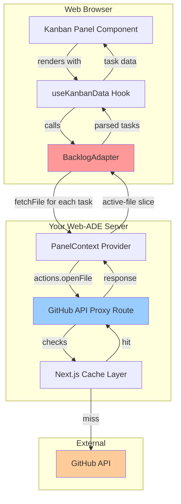
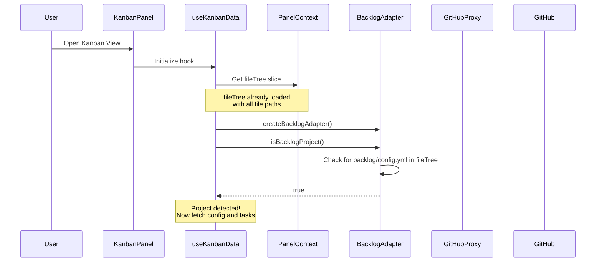
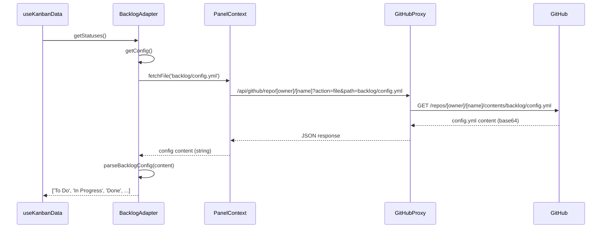
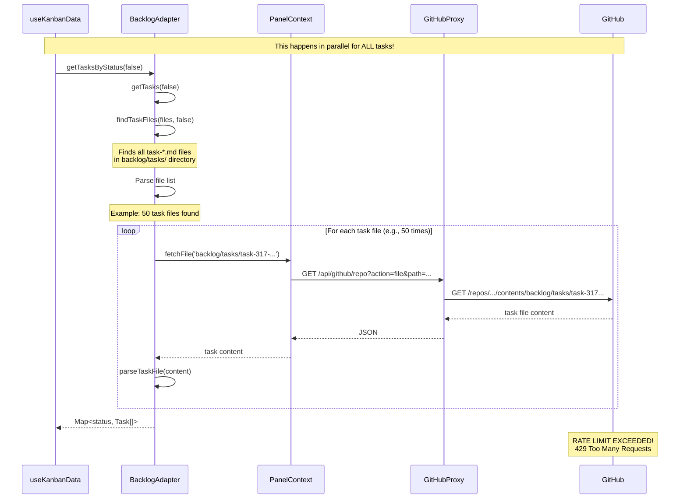

# Kanban Panel API Request Flow Analysis

## Overview

This document explains how the Kanban Panel requests data from GitHub and identifies the source of the rate limiting issues you're experiencing.

## Problem Summary

When the Kanban Panel loads, it makes **multiple sequential requests** to fetch individual task files from your GitHub repository through your API proxy. This causes a burst of requests that hits GitHub's rate limit (429 errors).

Error example:
```
GET /api/github/repo/MrLesk/Backlog.md?action=file&path=backlog%2Ftasks%2Ftask-317%20...
GitHub API Error: 429 too many requests
```

## Architecture Overview



## Request Flow - Step by Step

### Phase 1: Initial Panel Mount



### Phase 2: Config Loading (1 Request)



### Phase 3: Task Loading (N Requests - THE PROBLEM!)



## Key Code Locations

### 1. Panel Initialization
**File:** `industry-themed-backlogmd-kanban-panel/src/panels/kanban/hooks/useKanbanData.ts:180-183`

```typescript
// Load data on mount or when context changes
useEffect(() => {
  loadBacklogData();
}, [loadBacklogData]);
```

### 2. Task Fetching Loop
**File:** `industry-themed-backlogmd-kanban-panel/src/adapters/BacklogAdapter.ts:134-146`

```typescript
// THIS IS WHERE THE BURST HAPPENS!
const taskPromises = taskPaths.map(async (path) => {
  try {
    console.log('[BacklogAdapter] Fetching task:', path);
    const content = await this.fileAccess.fetchFile(path);  // ← Each calls GitHub API!
    return parseTaskFile(content, path);
  } catch (error) {
    console.error(`[BacklogAdapter] Failed to parse task file ${path}:`, error);
    return null;
  }
});

const taskResults = await Promise.all(taskPromises);  // ← All requests fire in parallel!
```

### 3. File Fetcher (Your Layer)
**File:** `web-ade/src/contexts/PanelContext.tsx:537-539`

```typescript
// Fetch file content from GitHub API
const response = await fetch(
  `/api/github/repo/${owner}/${name}?action=file&path=${encodeURIComponent(cleanPath)}`
);
```

### 4. API Proxy Route
**File:** `web-ade/src/app/api/github/repo/[owner]/[name]/route.ts:163-176`

```typescript
case "file":
  const filePath = searchParams.get("path");
  if (!filePath) {
    return NextResponse.json({ error: "File path required" }, { status: 400 });
  }
  data = await makeCachedGitHubRequest(
    `/repos/${owner}/${name}/contents/${filePath}`,
    `repo-file-${owner}-${name}-${filePath}`,
    CACHE_DURATIONS.file,  // ← 600 seconds (10 minutes)
    userToken,
  );
  break;
```

## Current Mitigations

### Temporary Limit (Currently Active)
**File:** `industry-themed-backlogmd-kanban-panel/src/panels/kanban/hooks/useKanbanData.ts:187`

```typescript
const TASKS_PER_COLUMN_LIMIT = 3; // Temporary limit for performance testing
```

This limits display to 3 tasks per column but **still fetches ALL tasks from GitHub**.

### Excludes Completed Tasks
**File:** `industry-themed-backlogmd-kanban-panel/src/panels/kanban/hooks/useKanbanData.ts:145`

```typescript
adapter.getTasksByStatus(false), // false = exclude completed tasks
```

Reduces the number of files fetched by excluding `backlog/completed/` directory.

### Cache Duration
**File:** `web-ade/src/app/api/github/repo/[owner]/[name]/route.ts:33`

```typescript
const CACHE_DURATIONS = {
  file: 600, // 10 minutes - individual files change rarely
}
```

Subsequent loads within 10 minutes will use cached data.

## Why This Happens

1. **Backlog.md Architecture**: Each task is a separate markdown file with YAML frontmatter
2. **Panel Design**: Needs to read all task files to display the kanban board
3. **API Limitations**: GitHub API has rate limits (60 req/hour unauthenticated, 5000 req/hour authenticated)
4. **Parallel Fetching**: `Promise.all()` fires all requests simultaneously

## Solutions to Consider

### Option 1: Backend Aggregation ⭐ RECOMMENDED
Create a new API endpoint that fetches and aggregates all tasks server-side in a single request.

**Pros:**
- Only 1 request from browser to your server
- Server can batch/parallelize GitHub requests more efficiently
- Can implement smarter caching strategies
- User's browser doesn't see N network requests

**Implementation:**
```typescript
// New endpoint: /api/backlog/[owner]/[name]/tasks
// Returns: { tasks: Task[], statuses: string[] }
```

### Option 2: Request Throttling/Batching
Limit concurrent GitHub API requests using a queue.

**Pros:**
- Prevents rate limit bursts
- Simple to implement

**Cons:**
- Slower loading time (sequential vs parallel)
- Still makes N requests total

### Option 3: Increase Cache Aggressiveness
Change cache duration from 10 minutes to 1 hour or longer.

**Pros:**
- Reduces repeat requests for same data
- Simple config change

**Cons:**
- Doesn't solve initial load problem
- Stale data for longer periods

### Option 4: Use User's GitHub Token
**File:** `web-ade/src/app/api/github/repo/[owner]/[name]/route.ts:105-106`

Your code already supports this! Just need to pass Authorization header.

**Pros:**
- 5000 req/hour instead of 60 req/hour
- Uses user's quota, not server's

**Cons:**
- Requires user authentication
- Still doesn't solve the N requests problem

### Option 5: Lazy Loading
Only fetch task details when user clicks/expands a task.

**Pros:**
- Minimal initial requests
- Much faster initial load

**Cons:**
- Requires significant panel redesign
- Worse UX for browsing all tasks

### Option 6: Client-Side Caching
Use browser localStorage/IndexedDB to cache task data.

**Pros:**
- Very fast on subsequent loads
- Reduces server requests

**Cons:**
- Requires manual invalidation strategy
- First load still slow

## Recommended Approach

**Implement Option 1 (Backend Aggregation) + Option 4 (User Token)**

1. Create `/api/backlog/[owner]/[name]/tasks` endpoint that:
   - Fetches all task files server-side
   - Parses and aggregates them
   - Returns complete task list in single response
   - Uses user's GitHub token for higher rate limits

2. Update panel to call new endpoint instead of fetching files individually

3. Add aggressive caching (1 hour) for the aggregated response

This reduces:
- **N requests → 1 request** (from browser perspective)
- **Rate limit issues** (server can handle batching better + user token)
- **Load time** (single round trip instead of N round trips)

## Data Flow Comparison

### Current (N+1 Requests)
```
Browser → API (config) → GitHub ✓
Browser → API (task 1) → GitHub ✓
Browser → API (task 2) → GitHub ✓
...
Browser → API (task N) → GitHub ✗ RATE LIMITED!
```

### Recommended (2 Requests)
```
Browser → API (config) → GitHub ✓
Browser → API (all tasks aggregated) → [GitHub (batch/parallel)] ✓
```

## Next Steps

1. **Measure the problem**: How many tasks does your repo have?
2. **Choose solution**: Based on repo size and usage patterns
3. **Test with user token**: See if rate limits are still hit
4. **Implement backend aggregation**: Most robust long-term solution

---

*Generated: 2025-11-19*
*Panel Version: 0.2.1*
