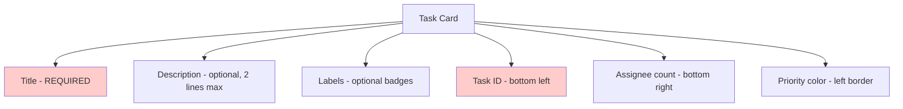
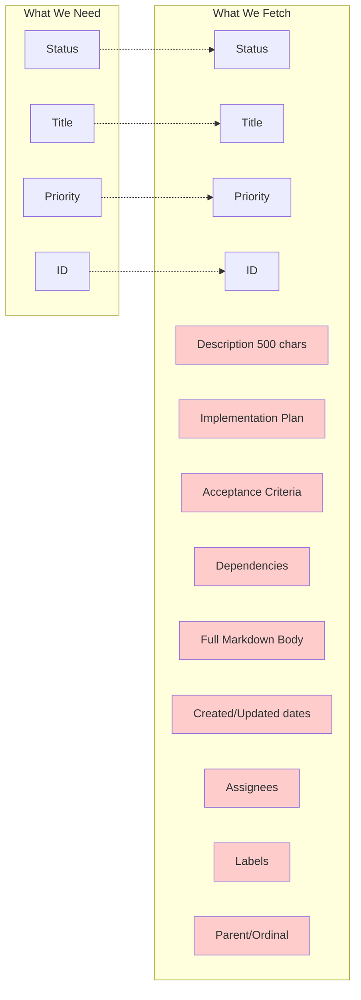
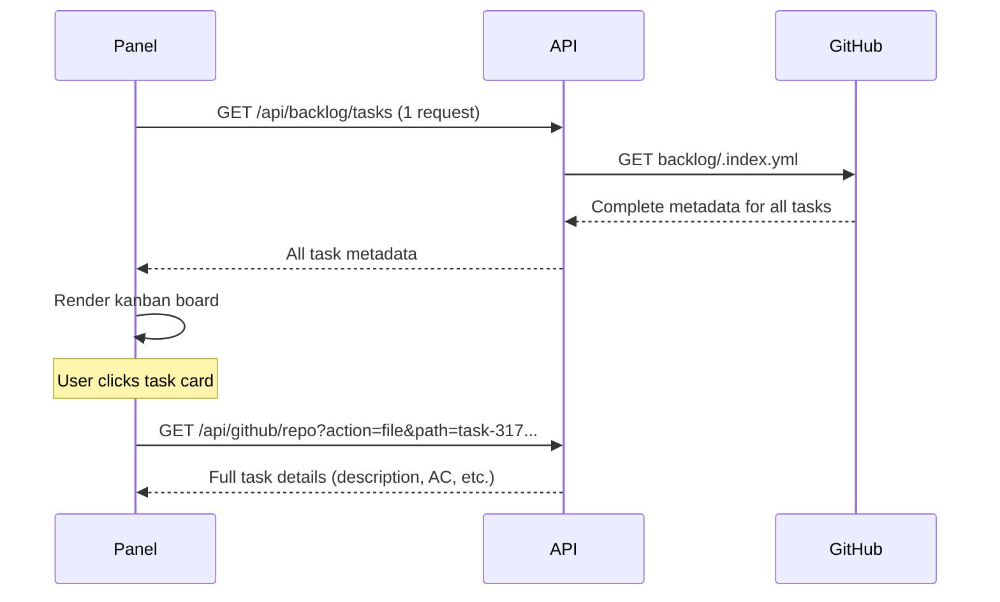

# Kanban Panel Data Requirements Analysis

## The Key Question: Why Fetch Every Task File?

You asked an excellent question: **What information is available from just the config and folder structure, versus what requires fetching individual task files?**

The answer reveals a significant optimization opportunity.

## What's Available WITHOUT Fetching Task Files

### From `backlog/config.yml` (1 API Request)

```yaml
project_name: "My Project"
default_status: "To Do"
statuses: ["To Do", "In Progress", "In Review", "Done"]
labels: ["bug", "feature", "enhancement"]
milestones: ["v1.0", "v2.0"]
date_format: "yyyy-mm-dd hh:mm"
```

**Available Data:**
- ✅ Project name
- ✅ All status columns (for kanban board structure)
- ✅ All available labels
- ✅ All milestones
- ✅ Default values

### From File Tree (Already Loaded)

The `fileTree` slice already contains all file paths from a single GitHub API request. Example:

```
backlog/config.yml
backlog/tasks/task-1-implement-auth.md
backlog/tasks/task-2-add-dashboard.md
backlog/tasks/task-317-add-mermaid-diagram.md
backlog/tasks/task-289-implement-resource-templates.md
backlog/completed/task-42-old-feature.md
```

**Available Data:**
- ✅ Task IDs (from filename: `task-317` → ID: `317`)
- ✅ Partial task titles (from filename: `task-317-add-mermaid-diagram.md` → title hint: "add mermaid diagram")
- ✅ Number of tasks per directory
- ✅ Which tasks are completed (in `backlog/completed/`)

## What REQUIRES Fetching Each Task File

Each task file has YAML frontmatter + markdown body:

```markdown
---
id: "317"
title: "Add Mermaid diagram rendering in web UI"
status: "In Progress"
assignee: ["john", "jane"]
created_date: "2025-01-15 10:30"
updated_date: "2025-01-16 14:20"
labels: ["enhancement", "ui"]
dependencies: ["289"]
priority: "high"
ordinal: 5
parent: "300"
---

## Description

Add support for rendering Mermaid diagrams in the web UI...

## Acceptance Criteria
<!-- AC:BEGIN -->
- [ ] Mermaid library integrated
- [ ] Diagrams render correctly
<!-- AC:END -->

## Implementation Plan

1. Install mermaid npm package...
```

**Data ONLY in Task File:**
- ❌ **title** - Full task title (not just filename hint)
- ❌ **status** - Which column this task belongs to (CRITICAL!)
- ❌ **assignee** - Who's working on it
- ❌ **priority** - high/medium/low
- ❌ **labels** - Which labels are applied
- ❌ **created_date** / **updated_date** - Timestamps
- ❌ **description** - Task description text
- ❌ **dependencies** - Related tasks
- ❌ **ordinal** - Sort order within column
- ❌ **parent** - For subtasks
- ❌ Acceptance criteria
- ❌ Implementation plan

## What the Kanban Board Actually Displays

Looking at `KanbanColumn.tsx`, here's what's shown on each card:



**Required from Task File:**
1. ✅ `task.id` - Displayed in footer (could parse from filename)
2. ✅ `task.title` - Main heading (MUST fetch)
3. ✅ `task.status` - Which column to place task (MUST fetch)
4. ✅ `task.priority` - Left border color (could default to 'medium')
5. ⚠️ `task.description` - Optional display (could lazy load)
6. ⚠️ `task.labels` - Optional badges (could lazy load)
7. ⚠️ `task.assignee` - Optional count (could lazy load)

## Current Implementation vs Minimum Required

### Current: Fetches Everything Eagerly

```typescript
// BacklogAdapter.ts - fetches ALL task files upfront
const taskPromises = taskPaths.map(async (path) => {
  const content = await this.fileAccess.fetchFile(path);  // API request!
  return parseTaskFile(content, path);  // Full parse
});

const taskResults = await Promise.all(taskPromises);  // 50+ requests in parallel!
```

**Result:**
- 50 tasks = 50+ API requests
- Fetches: title, status, assignee, priority, labels, description, acceptance criteria, implementation plan, etc.
- Uses: Only 5-6 fields for initial display

### Minimum Required: Fetch Only Metadata

The YAML frontmatter is ~10-20 lines, but we're fetching entire files (100-500 lines with descriptions, implementation plans, etc.)

## The Problem Visualized



## Optimization Opportunities

### Option A: Filename-Based Metadata ⚡ FASTEST

**Concept:** Encode critical metadata in the filename itself.

```
Current:  task-317-add-mermaid-diagram.md
Possible: task-317_status-in-progress_priority-high_title-add-mermaid-diagram.md
```

**Pros:**
- Zero API requests for basic kanban display
- Instant board rendering
- Works offline

**Cons:**
- Requires Backlog.md project structure changes
- Long filenames
- Not under your control

**Feasibility:** ❌ Would require upstream Backlog.md changes

### Option B: Metadata Index File ⭐ RECOMMENDED

**Concept:** Create a single JSON/YAML file with task metadata.

```yaml
# backlog/.index.yml (auto-generated by Backlog.md CLI)
tasks:
  - id: "317"
    title: "Add Mermaid diagram rendering"
    status: "In Progress"
    priority: "high"
    assignee: ["john"]
    labels: ["ui"]
    file: "backlog/tasks/task-317-add-mermaid-diagram.md"
  - id: "289"
    title: "Implement resource templates"
    status: "To Do"
    priority: "medium"
    assignee: []
    labels: ["backend"]
    file: "backlog/tasks/task-289-implement-resource-templates.md"
```

**Data Flow:**


**Benefits:**
- 1 API request instead of N+1
- ~5-10KB file vs 50+ individual requests
- Cache-friendly
- Still get all metadata needed

**Requirements:**
- Backlog.md CLI generates/updates `.index.yml` on task changes
- OR your backend aggregates task frontmatter server-side
- OR use GitHub Actions to generate index on push

**Feasibility:** ✅ Can implement server-side aggregation today

### Option C: Lazy Loading with Smart Defaults 🎯 HYBRID

**Concept:** Show skeleton cards initially, fetch details on-demand.

```typescript
// Initial render - NO API requests
const tasks = taskPaths.map(path => ({
  id: extractIdFromFilename(path),
  title: extractTitleFromFilename(path), // "task-317-add-mermaid" → "Add Mermaid"
  status: null, // Will fetch
  priority: 'medium', // Default
  skeleton: true
}));

// Then fetch metadata in batches
await fetchTaskMetadataBatch(tasks.slice(0, 20)); // First 20 tasks
```

**Benefits:**
- Instant initial render
- Progressive enhancement
- Reduced API requests (only fetch visible tasks)

**Drawbacks:**
- Can't organize by status without fetching
- Complicated state management

**Feasibility:** ⚠️ Partial - still need status to organize columns

### Option D: GitHub GraphQL API 🚀 ADVANCED

**Concept:** Use GitHub's GraphQL API to fetch multiple files in one request.

```graphql
query GetAllTasks {
  repository(owner: "MrLesk", name: "Backlog.md") {
    task317: object(expression: "main:backlog/tasks/task-317-...") {
      ... on Blob { text }
    }
    task289: object(expression: "main:backlog/tasks/task-289-...") {
      ... on Blob { text }
    }
    # ... repeat for all tasks
  }
}
```

**Benefits:**
- Single HTTP request
- Batch fetch up to 100 files
- More efficient than REST API

**Drawbacks:**
- Still fetches full file contents
- GraphQL query size limits
- More complex implementation

**Feasibility:** ✅ Can implement today, but limited benefit

## Critical Insight: The Status Problem

**The fundamental issue:** You CANNOT organize a kanban board by status column without knowing each task's status.

```
❌ Can't do this without fetching:
┌─────────┐  ┌─────────┐  ┌─────────┐
│ To Do   │  │Progress │  │  Done   │
├─────────┤  ├─────────┤  ├─────────┤
│ Task 1  │  │ Task 5  │  │ Task 8  │
│ Task 3  │  │ Task 7  │  │ Task 9  │
│ Task 4  │  │         │  │         │
└─────────┘  └─────────┘  └─────────┘
     ↑            ↑            ↑
   status:    status:      status:
   "To Do"  "In Progress"  "Done"
```

**The only way to avoid fetching:** Store status outside the task file (index file, database, or filename).

## Recommended Solution: Backend Aggregation

Since you control the backend, implement a server-side aggregation endpoint:

### Implementation Plan

```typescript
// New API endpoint: /api/backlog/[owner]/[name]/tasks
export async function GET(request: NextRequest, { params }) {
  const { owner, name } = await params;

  // 1. Fetch file tree (already cached)
  const tree = await fetchFileTree(owner, name);

  // 2. Find all task files
  const taskPaths = tree.filter(f =>
    f.path.match(/^backlog\/tasks\/task-\d+.*\.md$/)
  );

  // 3. Fetch all task files (server-side, can use batching/parallelization)
  const tasks = await Promise.all(
    taskPaths.map(async (path) => {
      const content = await fetchFileFromGitHub(path, userToken);
      return extractMetadataOnly(content); // Only parse YAML frontmatter
    })
  );

  // 4. Return aggregated data
  return NextResponse.json({
    tasks,
    statuses: await fetchStatuses(owner, name),
  });
}

function extractMetadataOnly(fileContent: string) {
  // Parse YAML frontmatter only, skip markdown body
  const frontmatter = fileContent.match(/^---\n([\s\S]*?)\n---/);
  if (!frontmatter) return null;

  const metadata = YAML.parse(frontmatter[1]);

  // Return only what's needed for kanban display
  return {
    id: metadata.id,
    title: metadata.title,
    status: metadata.status,
    priority: metadata.priority,
    assignee: metadata.assignee || [],
    labels: metadata.labels || [],
    // Skip: description, acceptance criteria, implementation plan, etc.
  };
}
```

### Data Savings

**Current:**
- 50 tasks × 500 lines average = 25,000 lines transferred
- 50 HTTP requests

**Optimized:**
- 50 tasks × 10 lines frontmatter = 500 lines transferred
- 1 HTTP request to your backend
- Backend makes 50 requests to GitHub (but from server, not rate-limited browser)

**Bandwidth Reduction:** ~98%
**Request Reduction:** 50 → 1 (from browser perspective)

## Summary Table

| Approach | API Requests | Initial Load | Status Column Support | Feasibility |
|----------|--------------|--------------|----------------------|-------------|
| **Current** | N+1 (50+) | Slow | ✅ Yes | ✅ Working now |
| **Metadata Index** | 2 | Fast | ✅ Yes | ⚠️ Requires index generation |
| **Backend Aggregation** | 1 | Medium | ✅ Yes | ✅ Can implement now |
| **Lazy Loading** | Variable | Fast | ❌ No | ⚠️ Can't organize by status |
| **GraphQL** | 1 | Medium | ✅ Yes | ✅ Can implement now |
| **Filename Metadata** | 0 | Instant | ✅ Yes | ❌ Requires upstream changes |

## Next Steps

1. **Immediate Fix:** Implement backend aggregation endpoint
   - Reduces browser requests from N+1 to 1
   - Keeps all current functionality
   - Easy to implement with existing code

2. **Medium-term:** Request Backlog.md to generate metadata index
   - Open issue on Backlog.md repository
   - Propose `.backlog-index.json` format
   - Would benefit all Backlog.md users

3. **Long-term:** Consider GitHub App with webhooks
   - Real-time updates when tasks change
   - Pre-computed task metadata
   - No polling needed

## The Bottom Line

**Why we need to fetch task files:** Because the `status` field (which determines which column a task appears in) is ONLY stored in the YAML frontmatter of each task file. Without it, we can't build the kanban board.

**What we're over-fetching:** Everything except the 6-7 frontmatter fields needed for the card display. We're fetching full descriptions, implementation plans, and acceptance criteria that aren't shown until the user clicks a task.

**Best optimization:** Backend aggregation to parse only frontmatter, not full file contents, and return aggregated metadata in a single API response.

---

*Generated: 2025-11-19*
