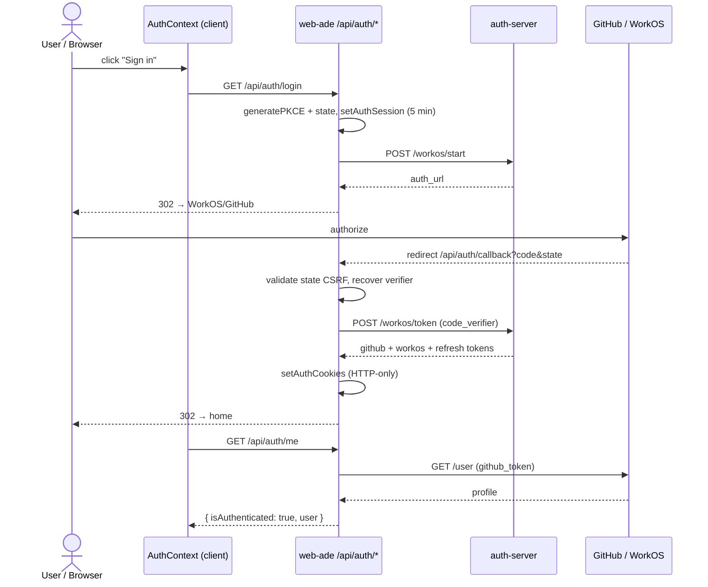
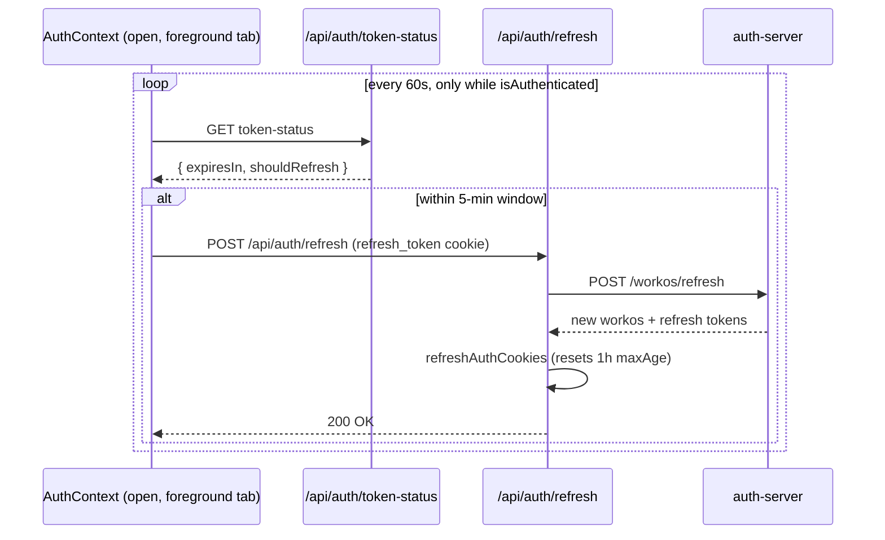
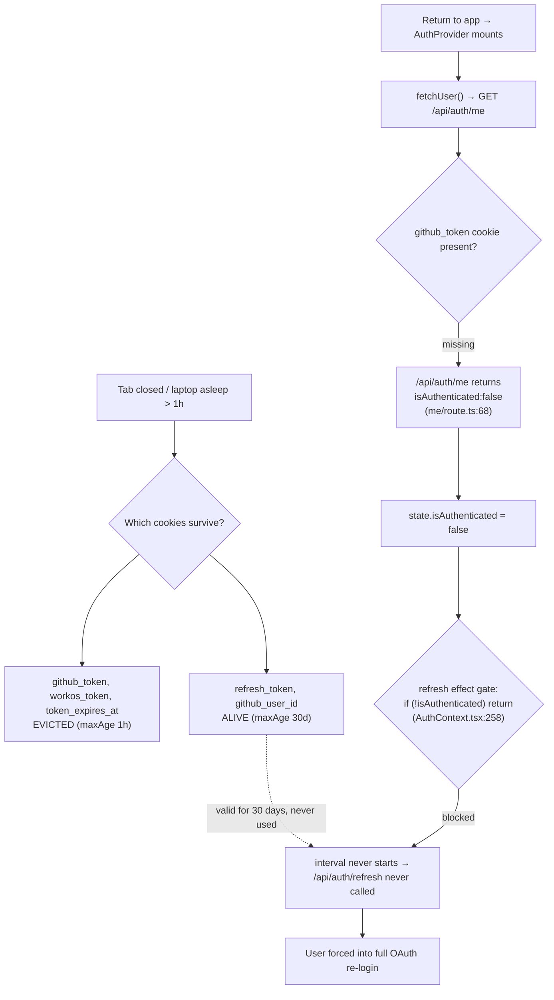
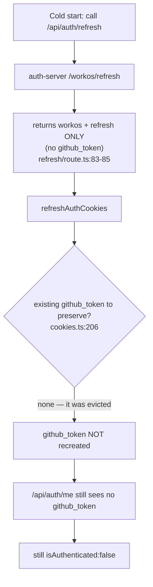
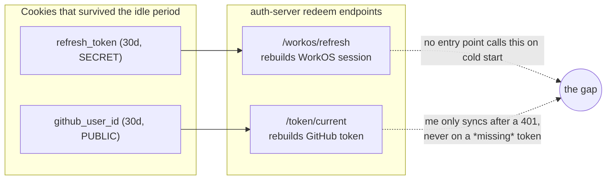
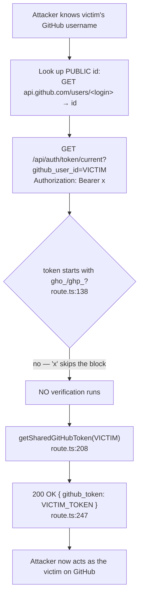
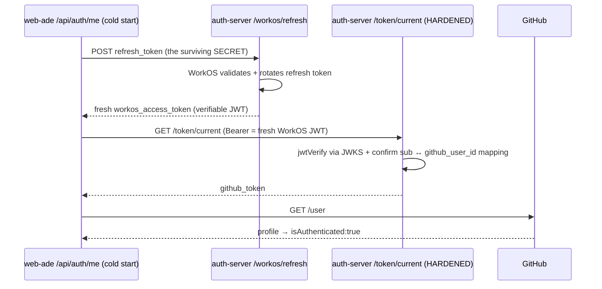
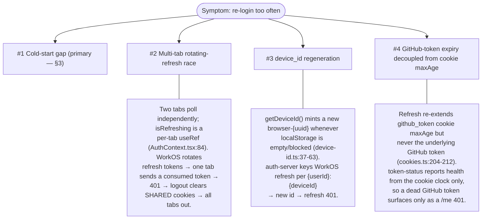

# Auth session expiry — why we re-login more than we should

**Status:** investigation · **Date:** 2026-05-31 · **Repo:** `web-ade` (+ `auth-server`)

This doc explains why an authenticated web-ade user gets bounced back to login
far more often than the **30-day** refresh token would imply. The headline cause
("case #1") is a **cold-start gap**: after ~1 hour of inactivity the session is
recoverable in principle but no code path actually recovers it.

Investigating the recovery path surfaced a **security finding** in the
auth-server (§4): the endpoint we'd lean on to rebuild the token,
`/api/auth/token/current`, discloses any user's GitHub token to an unauthenticated
caller. That finding reshapes the fix (§5).

---

## 1. The cookie lifetimes that set the trap

A fresh login writes five HTTP-only cookies via `setAuthCookies`
(`src/lib/auth/cookies.ts:59-91`) with **two** very different lifetimes:

| Cookie | `maxAge` | Survives >1h idle? | Role |
|---|---|---|---|
| `github_token` | **1 hour** | ❌ evicted | source of truth for "authenticated" |
| `workos_token` | **1 hour** | ❌ evicted | WorkOS access token |
| `token_expires_at` | **1 hour** | ❌ evicted | expiry marker the client polls |
| `refresh_token` | **30 days** | ✅ alive | redeem for a new WorkOS session (**the secret**) |
| `github_user_id` | **30 days** | ✅ alive | a **public** GitHub integer (NOT a secret) |

The whole system keys "are you logged in?" off `github_token`:
`isAuthenticated()` (`cookies.ts:139-141`), `/api/auth/me` (`me/route.ts:62`),
and `/api/auth/token-status` all check it.

So after the 1-hour access window lapses, the browser deletes the three short
cookies and you're left holding **two long-lived values** — `refresh_token`
(a real secret) and `github_user_id` (a public identifier).

---

## 2. The happy path (for reference)

### 2.1 Login



### 2.2 Steady-state refresh — works *while a tab is open*



This loop renews the 1-hour cookies indefinitely, which is **why the bug feels
intermittent** — an actively-used tab never hits the wall. The trouble starts
when no timer is running: the tab was closed, the laptop slept, or a background
tab was throttled/discarded for >1h.

---

## 3. Case #1 — the cold-start gap (primary cause)

### 3.1 What happens when you come back after >1h



Step by step:

1. `AuthProvider` mounts → `fetchUser()` runs (`AuthContext.tsx:274 → 90`).
2. It calls `/api/auth/me` (`:92`).
3. `/api/auth/me` reads `github_token` (`me/route.ts:62`) → **gone** → returns
   `{ isAuthenticated: false }` immediately (`:68-74`).
4. `fetchUser` sets `isAuthenticated: false` (`:95`).
5. The proactive-refresh effect is gated `if (!state.isAuthenticated) return;`
   (`AuthContext.tsx:258`) → **the 60s interval never starts**.
6. The reactive retry path has the same gate (`useAuthenticatedFetch.ts:45`).

Every path that could spend the 30-day `refresh_token` first checks
`isAuthenticated`, which is false *precisely because* the access token expired.
**Catch-22.**

### 3.2 The deeper twist: naive "refresh on mount" wouldn't even work

`/api/auth/refresh` cannot rebuild the GitHub token:



- The auth-server's refresh endpoint returns only `workos_access_token` +
  `refresh_token` — **no GitHub token** (`refresh/route.ts:83-85`).
- `refreshAuthCookies` only *re-extends* an existing GitHub token:
  `if (existingGithubToken) { ... }` (`cookies.ts:206-212`). On a cold start
  there's nothing to preserve, so it's never recreated.

### 3.3 The keys exist — but no entry point stitches them together

The GitHub token *can* be rebuilt from the central store via
`syncTokenFromServer` → auth-server `/api/auth/token/current`
(`me/route.ts:28-29`, `88-128`) — but that sync only runs *after* a GitHub call
returns 401 with an existing token (`:89`). On a cold start there's no token to
make that call with, so `/me` bails at `:68` and never tries.



This is where the recovery design and the security model collide — see §4.

---

## 4. ⚠️ Security finding: `/token/current` discloses any user's GitHub token

The endpoint we'd use to rebuild the GitHub token does **not** require the
secret. It hands the token out on a **public** identifier plus any throwaway
bearer string.

**Endpoint:** `GET /api/auth/token/current` —
`auth-server/src/app/api/auth/token/current/route.ts`

The only gate when `github_user_id` is supplied (`:135-151`):

```ts
if (githubUserId && !isNaN(githubUserId)) {
  // Verify the token if it looks valid, but don't fail if it's invalid
  if (token.startsWith("gho_") || token.startsWith("ghp_")) {
    const githubUser = await verifyGitHubToken(token);
    if (githubUser && githubUser.id !== githubUserId) {
      return 403; // user mismatch
    }
    // Token is valid and matches, OR token is invalid (we'll return stored token)
  }
}
// ...falls straight through...
return NextResponse.json({ github_token: storedToken.githubToken, ... }); // :247
```

A bearer that **doesn't** start with `gho_`/`ghp_` skips the whole block — no
verification runs — and the route returns the stored token. The WorkOS-JWT
verification path (`:155-165`) is only reached in the `else` branch, so
**supplying `github_user_id` bypasses JWKS verification entirely.**



The in-code "this is safe because" comment (`:130-134`) is wrong on every point:

| Claim | Reality |
|---|---|
| "`github_user_id` cookie is HTTP-only, can't be tampered with via JS" | The attacker crafts the request directly — no JS, no victim browser. `httpOnly` is irrelevant. And the id is public. |
| "the stored token only works for that user's GitHub account" | The endpoint *hands that token to the caller*. That's the disclosure. |
| "the user must have previously authenticated to have this cookie" | False — the attacker just sets the query param. |

Severity depends on whether `/api/auth/token/current` is reachable by attackers
(public origin vs. internal-only) — **confirm network exposure** — but the
authorization is broken regardless. Full writeup + patch:
`auth-server/docs/security/token-current-disclosure.md`.

**Consequence for the fix:** the earlier "have `/me` call `/token/current` keyed
by `github_user_id`" idea would have *worked only because the endpoint is
insecure* (cold start → empty bearer → token returned). That's the attacker's
own path. Scrap it.

---

## 5. The corrected (secure) fix

Rehydration must be driven by the **surviving secret — the `refresh_token`** —
not the public `github_user_id`. Secret → verified session → token.



Two changes required:

1. **auth-server — harden `/token/current`.** Remove the `github_user_id`
   shortcut. Never return a token on an unverified bearer: require a JWKS-verified
   WorkOS JWT whose subject maps to the requested user, **or** a *valid* GitHub
   token that matches. The existing WorkOS-JWT branch (`:155-165`) is the model.
2. **web-ade — cold-start bootstrap.** When `github_token` is missing but
   `refresh_token` is present, redeem it at `/workos/refresh`, then call the
   hardened `/token/current` with the fresh WorkOS JWT. This both *works* on a
   cold start and *is* secure.

---

## 6. Test coverage

Tests are written **before** the fix — they replicate the attack / capture the
bug, fail today (red), and turn green when the fix lands.

| Test | Location | Asserts | Status today |
|---|---|---|---|
| Token-disclosure attack replication | `auth-server/.../token/current/route.test.ts` | junk/forged bearer + victim id → **rejected**, no `github_token` in body | 🔴 red (returns 200 + token) |
| Legitimate caller control | same file | valid matching GitHub token → 200 + token | 🟢 green now & after fix |
| Cold-start bootstrap | `web-ade/src/contexts/__tests__/AuthContext.test.tsx` | missing `github_token` + valid `refresh_token` → ends `isAuthenticated:true` | 🔴 red |

The red attack test is the proof: run it against current `main` and it reports
*"expected 401, got 200, body contains github_token"* — i.e. the exploit
reproduced in CI.

---

## 7. Secondary causes (same symptom, different trigger)

These compound the re-login frequency once the cold-start gap is closed; confirm
with telemetry (§8) before investing.



---

## 8. Triage first — the telemetry already exists

- `/api/auth/me` → `auth.me.unauthenticated` with **`reason: 'no_token'`**
  (cold-start, #1) vs **`reason: 'invalid_token_after_sync'`** (#3/#4).
- `/api/auth/token-status` → `token.check.unauthenticated`.
- `/api/auth/refresh` currently only `console.error`s on failure — add a span
  event splitting **`invalid_grant` (401)** from network/5xx so #2/#3 become
  countable.

Read the `reason` distribution over a week → it tells you whether to ship the §5
fix first (almost certainly) or chase a secondary cause.

---

## Key source references

| Concern | File | Lines |
|---|---|---|
| Cookie lifetimes on login | `web-ade/src/lib/auth/cookies.ts` | 59-91 |
| Refresh only re-extends existing GitHub token | `web-ade/src/lib/auth/cookies.ts` | 204-212 |
| Refresh returns no GitHub token | `web-ade/src/app/api/auth/refresh/route.ts` | 83-85 |
| `/me` bails on missing token (the gap) | `web-ade/src/app/api/auth/me/route.ts` | 62, 68-74 |
| `/me` central-store sync (only after a 401) | `web-ade/src/app/api/auth/me/route.ts` | 28-29, 88-128 |
| Proactive-refresh gate | `web-ade/src/contexts/AuthContext.tsx` | 257-269 (`:258`) |
| Reactive-refresh gate | `web-ade/src/hooks/useAuthenticatedFetch.ts` | 45 |
| Per-tab refresh guard | `web-ade/src/contexts/AuthContext.tsx` | 84 |
| device_id regeneration | `web-ade/src/lib/device-id.ts` | 37-63 |
| **Token-disclosure vulnerability** | `auth-server/src/app/api/auth/token/current/route.ts` | 130-151, 247 |
