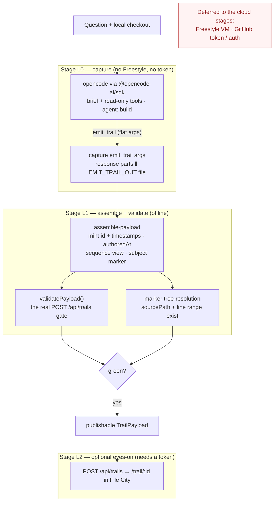

# Local Test Plan — opencode authoring without Freestyle or a token

**Topic:** `topic-1781154092475-a1ls0neji` ("Hosted trail authoring: ask-a-question → get-a-trail")
**Companion to:** `docs/hosted-trail-authoring.md` (the full implementation + staged plan)

This doc narrows the full plan down to **what we can run on a laptop today**, before
standing up any cloud infra. The goal is to prove the *new and risky* half of the
pipeline — opencode + the authoring brief + the `emit_trail` contract + payload
assembly + marker validation — while skipping **both** the Freestyle VM **and** the
GitHub token / auth setup.

## Pipeline at a glance

## 1. The core realization: both VM and token are skippable

The production pipeline has two pieces of setup we'd rather not build just to test the
agent:

- **The Freestyle VM** exists only to amortize repo checkout across questions. It has
  nothing to do with whether opencode produces a good trail. → Run `opencode` against a
  **local checkout** instead.
- **The GitHub token / auth** is required *only* by the HTTP route `POST /api/trails`
  (`src/app/api/trails/route.ts:53` → `getGitHubToken()` → 401, then `checkRepoAccess`).
  But the actual contract — "is this payload publishable?" — is the **pure exported
  function** `validatePayload()` (`src/lib/trails/validation.ts:383`), wrapped by
  `validateCreateRequest()` (line 547). We call that function directly. No server, no
  auth, no network. If a payload passes `validatePayload()`, it would pass the endpoint.

So the local proof is:

> opencode emits flat `emit_trail` args → assemble into a `TrailPayload` → `validatePayload()`
> returns clean, and every marker's `sourcePath` + line range resolves in the local tree.

That needs nothing but Node, opencode, and a checkout.

## 2. Environment (already present on this machine)

| Dependency | Status |
|---|---|
| opencode | installed — `~/.opencode/bin/opencode`, v1.17.3 |
| `validatePayload` / `validateCreateRequest` | `web-ade/web-ade/src/lib/trails/validation.ts` (exported) |
| `POST /api/trails` smoke test reference | `web-ade/web-ade/docs/file-city-trail-sharing.md` |
| `TrailPayload` type | `@industry-theme/file-city-panel` → `Trail.d.ts` |
| A repo to author against | this repo (small, known) works as the Stage 0 target |

`opencode run [message..]` gives a one-shot headless mode, and `opencode serve` gives the
REST + SSE server. For local testing prefer **`opencode run`** — no server lifecycle to
manage.

## 3. Stage L0 — capture a payload from opencode (no Freestyle, no token)

**Goal:** prove opencode + the brief + `emit_trail` produce a schema-valid payload against a
known local repo.

**The capture trick:** don't scrape the SSE stream for the tool call. Instead define
`emit_trail` as a **local opencode custom tool** (project-local `.opencode/tool/`) whose
handler simply writes its arguments to `trail-payload.json` and signals completion. opencode
runs the tool handler locally, so it hands us the args directly — no streaming parser, no
server to babysit.

Steps:
1. Check out a small known repo locally (e.g. this one).
2. Add the `emit_trail` custom tool (handler dumps args → `trail-payload.json`).
3. Bind read-only exploration tools (read/grep/list) + `emit_trail`; no write tools, no
   network egress.
4. Run with the trail-authoring brief + a fixed question, e.g.
   `opencode run "How does POST /api/trails validate payloads?"`.
5. The brief (opencode system prompt) is derived from the `author-investigation-trail` /
   `author-informative-trail` skills — those are the spec for a good trail. Default
   `purpose: 'investigation'`; mark the answer marker `kind: 'subject'`.

**Pass:** `trail-payload.json` exists and its args satisfy the flat `emit_trail` schema
(see `docs/hosted-trail-authoring.md` §4), and every `sourcePath` + line range resolves in
the local checkout.

**To confirm during implementation:** opencode 1.17's exact custom-tool definition format
(file location + export shape under `.opencode/tool/`). The mechanism exists; the precise
signature in this version is the one unknown.

## 4. Stage L1 — assemble + validate offline (no Freestyle, no token)

**Goal:** the flat args become a publishable `TrailPayload` that passes web-ade's real
validation, entirely offline.

A small script (~30 lines):
1. Read `trail-payload.json` (the flat `emit_trail` args).
2. Run the `assemble-payload` logic: mint `id` (`crypto.randomUUID()`) + ISO timestamps,
   attach `authoredAt: { sha, ref }`, build the `kind: 'sequence'` view from marker order,
   stamp `kind: 'subject'` on `subjectMarkerId`.
3. Import `validatePayload` from `src/lib/trails/validation.ts` and run it on the assembled
   payload — the **same** gate the HTTP route uses.
4. Re-check every marker `sourcePath` exists and `startLine`/`endLine` are within the file,
   against the local tree (this is the `validate-payload` responsibility).

**Pass:** payload passes `validatePayload()` offline; all markers point at real lines.
**This is where most of the risk lives** and it needs nothing but Node + the checkout.

## 5. Stage L2 (optional) — eyes-on render

**Goal:** actually *see* the trail in File City. This is the only local stage that wants a
token, and it is fully separable — skip it and Stages L0–L1 still prove the agent works.

- Run a local web-ade (`HOST=http://localhost:3000`) with a throwaway GitHub token.
- `POST /api/trails` with the Stage L1 payload, mirroring the smoke test in
  `docs/file-city-trail-sharing.md`.
- Open `/trail/{id}`; confirm markers light buildings in File City and the Pierre drawer
  shows the right slices.

Because this is the **existing** publish/render stack, there's nothing new being tested
here — it only gives a visual gut-check.

## 6. What this proves, and what it defers

Stages L0–L1 exercise everything *new* in the design — the brief, the `emit_trail`
contract, assembly, and marker validation — with **no Freestyle, no GitHub App, no token**.
What remains deferred to the cloud stages (`docs/hosted-trail-authoring.md` §7, Stages 3–5):

- Stage 3 — running L0–L2 *inside* a Freestyle VM.
- Stage 4 — the app's async `POST /api/authoring/runs` flow + inbox/feed delivery.
- Stage 5 — VM lifecycle, concurrency, and private-repo auth.

Each of those only *wraps* code proven locally here.

## 7. Suggested first action

Wire up Stage L0 + L1 as a single runnable: the `emit_trail` capture tool plus the
assemble+validate script, so one command answers "does opencode produce a passing payload
against this repo?" That single green run de-risks the whole project before any cloud work.
