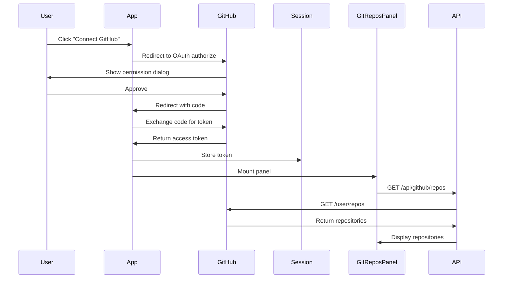

# @principal-ade/git-repos-panel

GitHub repository browser panel with integrated theming and OAuth support for Principal ADE.

> **Status**: Core components implemented and functional. Real-time synchronization and advanced filtering coming soon.

## Features

### ✅ Implemented
- ✅ Seamless integration with `@a24z/industry-theme`
- ✅ GitHub OAuth authentication flow
- ✅ Repository listing with metadata (language, stars, privacy, etc.)
- ✅ Real-time repository data fetching
- ✅ Panel framework compatibility (`@principal-ade/panel-framework-core`)
- ✅ Responsive repository cards with hover states
- ✅ Error handling and loading states
- ✅ Lucide React icons throughout
- ✅ TypeScript support with full type definitions
- ✅ Empty state handling
- ✅ Auto-refresh functionality

### 🚧 Coming Soon
- Local repository detection and sync
- Repository search and filtering
- Clone repository functionality
- Branch and commit visualization
- GitHub Actions status integration
- Pull request preview
- Repository health metrics
- Storybook documentation
- Unit and E2E tests

## Installation

```bash
npm install @principal-ade/git-repos-panel @a24z/industry-theme @principal-ade/panel-framework-core
```

or with bun:

```bash
bun add @principal-ade/git-repos-panel @a24z/industry-theme @principal-ade/panel-framework-core
```

## Quick Start

### 1. Set up GitHub OAuth

First, configure your GitHub OAuth application:

```typescript
// .env.local
GITHUB_CLIENT_ID=your_client_id
GITHUB_CLIENT_SECRET=your_client_secret
GITHUB_REDIRECT_URI=http://localhost:3000/api/auth/callback
```

### 2. Create API Routes

```typescript
// app/api/github/repos/route.ts
import { NextResponse } from 'next/server';
import { getSession } from '@/lib/auth/session';

export async function GET() {
  const session = await getSession();

  if (!session?.accessToken) {
    return NextResponse.json({ error: 'Not authenticated' }, { status: 401 });
  }

  const response = await fetch(
    'https://api.github.com/user/repos?sort=updated&per_page=100',
    {
      headers: {
        Authorization: `Bearer ${session.accessToken}`,
        Accept: 'application/vnd.github.v3+json',
      },
    }
  );

  const repos = await response.json();
  return NextResponse.json(repos);
}
```

### 3. Use the Panel Component

```tsx
import { GitReposPanel } from '@principal-ade/git-repos-panel';
import { PanelProvider } from '@/contexts/PanelContext';
import { useTheme } from '@a24z/industry-theme';

function App() {
  const { theme } = useTheme();

  return (
    <PanelProvider>
      <GitReposPanel />
    </PanelProvider>
  );
}
```

## Available Components

### `<GitReposPanel />`
Main repository browser component with full GitHub integration.

**Props:**
- `apiEndpoint` - GitHub API endpoint (default: `/api/github/repos`)
- `onRepositorySelect` - Callback when repository is selected
- `showPrivate` - Show private repositories (default: true)
- `sortBy` - Sort repositories by ('updated' | 'name' | 'stars')
- `maxRepositories` - Maximum repositories to display (default: 100)

**Example:**
```tsx
<GitReposPanel
  apiEndpoint="/api/github/repos"
  onRepositorySelect={(repo) => {
    console.log('Selected:', repo.name);
  }}
  sortBy="updated"
  showPrivate={true}
/>
```

### `useGitRepos`
Hook for accessing repository data and actions.

```tsx
const {
  repos,
  loading,
  error,
  refresh,
  selectRepository
} = useGitRepos();

// Refresh repositories
await refresh();

// Select a repository
selectRepository(repo);
```

### Additional Components
- `<RepositoryCard />` - Individual repository display with metadata
- `<RepositoryList />` - Scrollable list of repositories
- `<RepositoryHeader />` - Panel header with refresh and filter controls
- `<EmptyRepositoryState />` - Empty state when no repositories found
- `<RepositoryMetadata />` - Language, stars, and branch info display

## Panel Framework Integration

This package is designed to work seamlessly with `@principal-ade/panel-framework-core`:

```typescript
import { GitReposPanel } from '@principal-ade/git-repos-panel';
import { usePanelProvider } from '@/contexts/PanelContext';

function MyWorkspace() {
  const { context, actions, events } = usePanelProvider();

  // Listen for repository selection events
  useEffect(() => {
    const unsubscribe = events.on('repository:selected', (event) => {
      const { repository } = event.payload;
      console.log('Repository selected:', repository);
    });

    return unsubscribe;
  }, [events]);

  return <GitReposPanel />;
}
```

### Event Types

The panel emits the following events:

- `repository:selected` - When a repository is clicked
- `repository:cloned` - When a repository is cloned locally
- `repository:refresh` - When repository data is refreshed

## Data Slices

The panel integrates with these data slices:

- `git-repos` (workspace scope) - GitHub repository list
- `selected-repo` (workspace scope) - Currently selected repository

```typescript
const { context } = usePanelProvider();

// Access git repos slice
const gitReposSlice = context.getWorkspaceSlice<GitRepository[]>('git-repos');

if (gitReposSlice && !gitReposSlice.loading) {
  console.log('Repositories:', gitReposSlice.data);
}
```

## Styling

The panel uses `@a24z/industry-theme` for consistent styling:

```tsx
import { useTheme } from '@a24z/industry-theme';

function CustomPanel() {
  const { theme } = useTheme();

  // Theme provides:
  // - theme.colors.* (primary, background, text, etc.)
  // - theme.fontSizes[0-9]
  // - theme.space[0-9]
  // - theme.radii.*
}
```

## Authentication Flow



## TypeScript Types

```typescript
interface GitRepository {
  id: number;
  name: string;
  full_name: string;
  description: string | null;
  html_url: string;
  clone_url: string;
  default_branch: string;
  language: string | null;
  updated_at: string;
  stargazers_count: number;
  private: boolean;
  owner: {
    login: string;
    avatar_url: string;
  };
}

interface GitReposPanelProps {
  apiEndpoint?: string;
  onRepositorySelect?: (repo: GitRepository) => void;
  showPrivate?: boolean;
  sortBy?: 'updated' | 'name' | 'stars';
  maxRepositories?: number;
}

interface UseGitReposReturn {
  repos: GitRepository[];
  loading: boolean;
  error: string | null;
  refresh: () => Promise<void>;
  selectRepository: (repo: GitRepository) => void;
}
```

## Advanced Usage

### Custom Repository Filtering

```tsx
import { GitReposPanel, useGitRepos } from '@principal-ade/git-repos-panel';

function FilteredReposPanel() {
  const { repos, loading } = useGitRepos();
  const [filter, setFilter] = useState('');

  const filteredRepos = useMemo(() => {
    return repos.filter(repo =>
      repo.name.toLowerCase().includes(filter.toLowerCase()) ||
      repo.description?.toLowerCase().includes(filter.toLowerCase())
    );
  }, [repos, filter]);

  return (
    <div>
      <input
        value={filter}
        onChange={(e) => setFilter(e.target.value)}
        placeholder="Search repositories..."
      />
      <GitReposPanel repos={filteredRepos} loading={loading} />
    </div>
  );
}
```

### Local Repository Sync

```tsx
import { GitReposPanel } from '@principal-ade/git-repos-panel';

function SyncedReposPanel() {
  const handleRepoSelect = async (repo: GitRepository) => {
    // Clone repository locally
    const response = await fetch('/api/git/clone', {
      method: 'POST',
      body: JSON.stringify({
        url: repo.clone_url,
        name: repo.name,
      }),
    });

    if (response.ok) {
      const { path } = await response.json();
      console.log('Repository cloned to:', path);
    }
  };

  return (
    <GitReposPanel
      onRepositorySelect={handleRepoSelect}
    />
  );
}
```

### Panel Layout Configuration

```tsx
import { EditableConfigurablePanelLayout } from '@principal-ade/panel-layouts';
import { GitReposPanel } from '@principal-ade/git-repos-panel';

const panelDefinitions = [
  {
    id: 'git-repos',
    label: 'My Repositories',
    component: GitReposPanel,
    icon: <Github size={16} />,
  },
  // ... other panels
];

const layout = {
  left: {
    type: 'tabs',
    panels: ['git-repos', 'file-tree'],
  },
  middle: {
    type: 'tabs',
    panels: ['editor'],
  },
};

function Workspace() {
  return (
    <EditableConfigurablePanelLayout
      panels={panelDefinitions}
      layout={layout}
    />
  );
}
```

## Documentation

- [DESIGN.md](./DESIGN.md) - Detailed architecture and design decisions
- [API.md](./API.md) - Complete API reference
- [EXAMPLES.md](./EXAMPLES.md) - Usage examples and recipes

## Development

```bash
# Install dependencies
bun install

# Start Storybook
bun run storybook

# Build
bun run build

# Type checking
bun run typecheck

# Linting
bun run lint

# Testing
bun run test
```

## Contributing

Contributions are welcome! Please read our [Contributing Guide](./CONTRIBUTING.md) for details.

## License

MIT © Principal ADE Team

## Support

- GitHub Issues: [principal-ade/git-repos-panel](https://github.com/principal-ade/git-repos-panel/issues)
- Documentation: [https://principal-ade.com/docs/panels/git-repos](https://principal-ade.com/docs/panels/git-repos)
- Discord: [Principal ADE Community](https://discord.gg/principal-ade)
